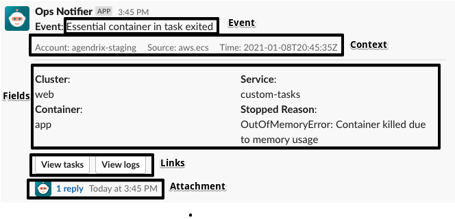

# EventBridge Slack notifier

_An AWS Lambda for sending EventBridge events to Slack channels_

 

## Description

The goal of this module is to send a Slack message to a specific channel when an EventBridge [rule](https://docs.aws.amazon.com/eventbridge/latest/userguide/create-eventbridge-rule.html) is triggered.

## Lambda payload

The lambda function payload is an object with the following type:

```ts
type Payload = {
  event: string;
  context: Array<Text> | undefined;
  fields: Array<Text> | undefined;
  body: Text | undefined;
  links: Array<Link> | undefined;
  attachment: object | undefined;
};

type Link = {
  label: string;
  url: string;
};

type Text = {
  label: string;
  text: string;
};
```

`event`: String representing the event name. Required

`context`: Array containing event context information (Time, Event Source, etc). Optional

`fields`: Array containing event details. Field objects will be rendered side by side. Optional

`boyd`: Message body. Optional

`links`: Array containing Link objects. Each Link will be rendered has a button. Optional

`attachment`: If provided, this object will be attached as a JSON document in the message thread. Optional

## Example:



## How to use with Terraform

Add the module to your [Terraform](https://www.terraform.io/) project:

```HCL
module "eventbridge_slack_notifier" {
  source = "github.com/agendrix/eventbridge-slack-notifier.git//terraform?ref=v0.2.0"

  slack_config = {
    channel      = "#channel"
    access_token = "access_token"
  }

  event_pattern = jsonencode({
    source      = ["aws.cloudwatch"]
    detail-type = ["CloudWatch Alarm State Change"]
  })


  input_transformer = {
    input_paths = {
      source                     = "$.source"
      time                       = "$.time"
      alarm                      = "$.detail.alarmName"
      previous_state_value       = "$.detail.previousState.value"
      current_state_value        = "$.detail.state.value"
      current_state_value_reason = "$.detail.state.reason"
    }

    input_template = <<EOF
    {
      "event": <alarm>,
      "context": [
        {
          "label": "Source",
          "text": <source>
        },
        {
          "label": "Time",
          "text": <time>
        }
      ],
      "fields": [
        {
          "label": "Previous Alarm State",
          "text": <previous_state_value>
        },
        {
          "label": "Current Alarm State",
          "text": <current_state_value>
        }
      ],
      "body": {
        "label": "Details",
        "text": <current_state_value_reason>
      },
      "links": [
        {
          "label": "View alarms",
          "url": "https://ca-central-1.console.aws.amazon.com/cloudwatch/home?region=ca-central-1#alarmsV2:"
        }
      ]
    }
    EOF
  }
}
```

### Resources:

[How to create a rule pattern](https://docs.aws.amazon.com/eventbridge/latest/userguide/eventbridge-and-event-patterns.html)

[Input transformer](https://docs.aws.amazon.com/eventbridge/latest/userguide/transform-input.html)

[Input transformer Terraform](https://registry.terraform.io/providers/hashicorp/aws/latest/docs/resources/cloudwatch_event_target#input_transformer)

[Common input transformer issues](https://docs.aws.amazon.com/eventbridge/latest/userguide/transform-input.html#transform-input-issues)
