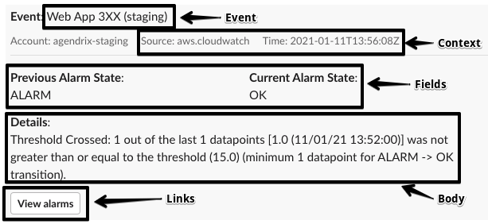

# EventBridge Slack notifier

_An AWS Lambda for sending EventBridge events to Slack channels_

 

## Description

The goal of this module is to send a Slack message to a specific channel when an EventBridge [rule](https://docs.aws.amazon.com/eventbridge/latest/userguide/create-eventbridge-rule.html) is triggered.

## Lambda payload

The lambda function payload is an object with the following type:

```ts
type Payload = {
  event: string;
  context: Array<Text> | undefined;
  fields: Array<Text> | undefined;
  links: Array<Link> | undefined;
  attachment: object | undefined;
};

type Link = {
  label: string;
  url: string;
};

type Text = {
  label: string;
  text: string;
};
```

`event`: String representing the event name. Required

`context`: Object containing event context information (Time, Event Source, etc). Optional

`fields`: Object containing event details. Each key value pair will be rendered in the main message section. Optional

`links`: Array containing Link objects. Each Link will be rendered has a button. Optional

`attachment`: If provided, this object will be attached as a JSON document in the message thread. Optional

## Example:



## How to use with Terraform

Add the module to your [Terraform](https://www.terraform.io/) project:

```HCL
module "eventbridge_slack_notifier" {
  source = "github.com/agendrix/eventbridge-slack-notifier.git//terraform?ref=v0.2.0"

  slack_config = {
    channel      = "#channel"
    access_token = "access_token"
  }

  event_pattern = jsonencode({
    source      = ["aws.ecs"]
    detail-type = ["ECS Task State Change"]
    detail = {
      lastStatus    = ["STOPPED"],
      stoppedReason = ["Essential container in task exited"]
      clusterArn    = [aws_ecs_cluster.cluster.arn]
    }
  })


  input_transformer = {
    input_paths = {
      event          = "$.detail.stoppedReason"
      source         = "$.source"
      time           = "$.time"
      container      = "$.detail.containers[0].name"
      service        = "$.detail.group"
    }

    input_template = <<EOF
    {
      "event": <event>,
      "context": [
        {
          "label": "Source",
          "text": <source>
        },
        {
          "label": "Time",
          "text": <time>
        }
      ],
      "fields": [
        {
          "label": "Cluster",
          "text": "${aws_ecs_cluster.cluster.name}"
        },
        {
          "label": "Service",
          "text": <service>
        },
        {
          "label": "Container",
          "text": <container>
        },
      ],
      "links": [
        {
          "label": "View tasks",
          "url": "https://ca-central-1.console.aws.amazon.com/ecs/home?region=ca-central-1#/clusters/${aws_ecs_cluster.cluster.name}/tasks"
        },
      ],
      "attachment": {
        "event" : <aws.events.event>,
      }
    }
    EOF
  }
}
```
